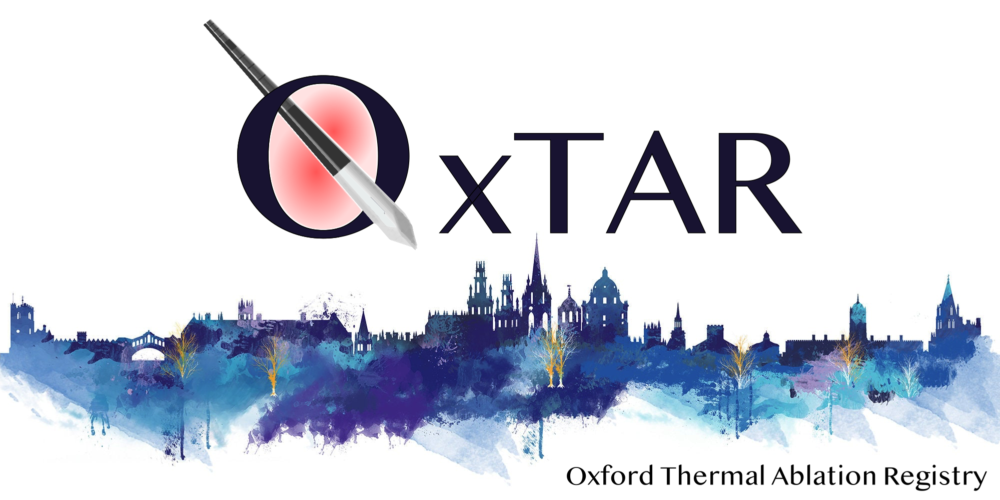

{#id .class width=70% height=70%}

## OxTAR: Oxford Thermal Ablation Registry

OxTAR is a registry for thermal ablation of tumours, specifically CT- or Ultrasound-guided percutaneous microwave or cryo-ablation of lung, liver, adrenal and kidney tumours, but is equally applicable to sarcoma and musculoskeletal ablations.

It uses the Castor EDC platform and can be accessed using this link: <https://uk.castoredc.com>

This Graphical User Inferface uses the EDC Application Programmers Interface (API) to access the live Castor EDC data via the R scripting language. It can be used to used to generate plots of time to treatment (based on referral data), local recurrence and survial (based on the imaging and follow-up data).

V0.73 (c) 2023
Conception, Design, Implementation: Dr. Paul C. Lyon (<paulclyon@gmail.com>)
Contributors: Dr. Mark Anderson, Dr. Yan Li
