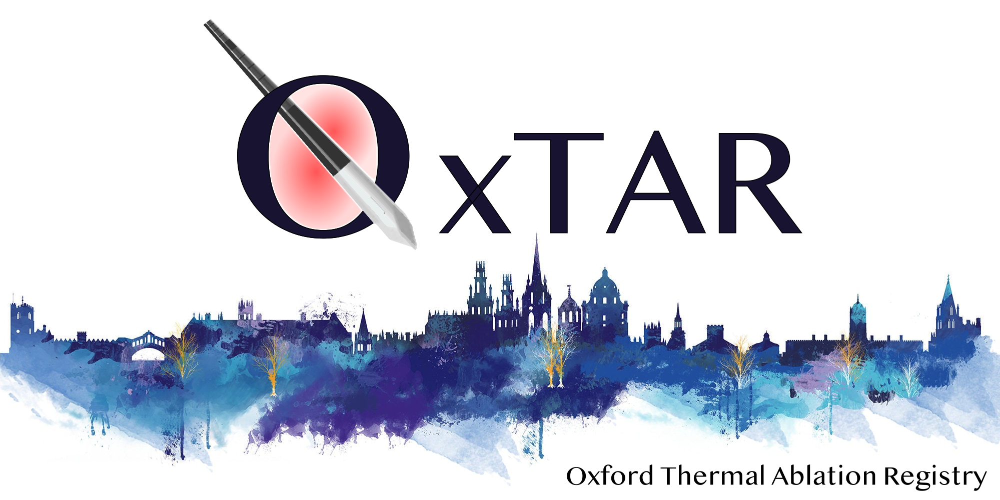

{#id .class width=70% height=70%}

## OxTAR: Change Log

V0.10  Pilot 
V0.20  Fixed bugs, introduced About, ChangeLog, Table 
V0.30  Added API Connection button to allow dynamic loading, made it Docker-ready & implemented Shiny Dashboard 
V0.40  Added Referral Clock Stops 
V0.50  Added Survival plot and data export Functions 
V0.60  Added Recurrence plot, Pre-/Post-DDT clock stops and dropdown for API study loading
V0.61  Ironed out some bugs with clock stops
V0.70  Added Referral Pathway Audit Report by Andrew Thornton
V0.71  Added Provisional Treatment Date
V0.72  Fixed JSON bug with empty matrix (when not NA)
V0.73  Improved debug output logs for referral analysis